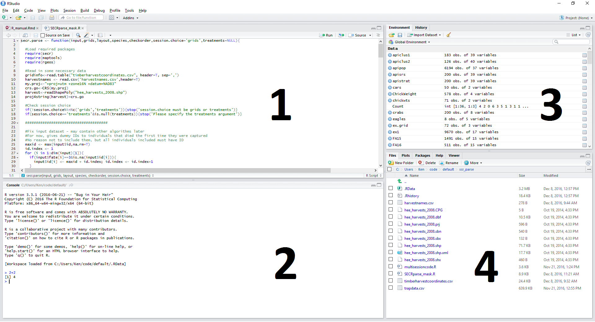
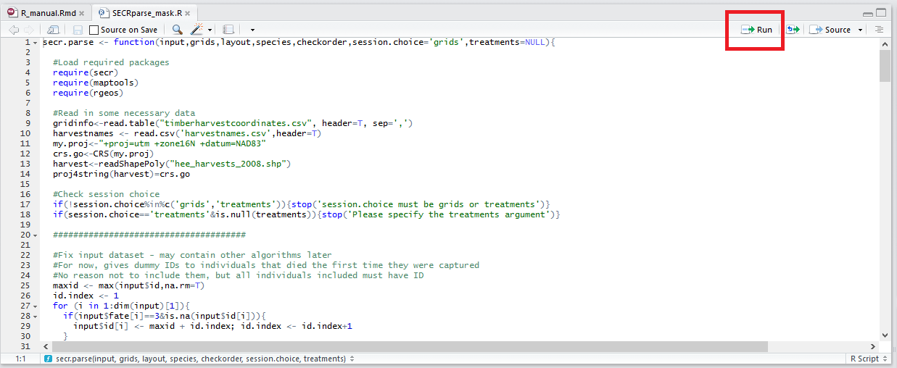

### How to Get R

R is free software availabe for Windows, Mac, and Linux. 

 - On FNR lab computers, you can access R at Start > All Programs > R > R x64 3.x.x (or similar).
 - To use R on a personal computer, download at the following links: 
    - [Windows](https://cran.r-project.org/bin/windows/base/)
    - [Mac](https://cran.r-project.org/bin/macosx/)
    - [Linux](https://cran.r-project.org/bin/linux/)
  
While you can use R by itself, I highly suggest accessing it via RStudio. RStudio is a more modern interface for R that simplifies many tasks and helps to keep you organized. I will be using it in lectures. RStudio is also completely free and can be downloaded [here](https://www.rstudio.com/products/rstudio/download/). 

### Basics of the RStudio Interface

By default, RStudio has four individual panes:



1. Scripts: A tabbed list of files containing lists of R commands to run (saved analyses, etc.). If you are missing this pane, click on File > New File > R script. At the top right of this pane is a "Run" button that will send the line in the script your cursor is on to the console below.

2. Console: Where you input R commands and view output.

3. Environment/history: Lists of R objects you have created and past commands you have run.

4. Files/Plots/Help: A utility pane that shows various information including plots you have created, help files you have searched for, and files in your working directory.

### Using the R *Console*

The R console is analogous to a calculator. You type commands in R code in at the prompt (`>`) and the answer is returned below. In this manual, I will represent R commands using a special font in grey boxes that looks like 

```{r, eval=FALSE}
this.
```

Output from those commands will be in a white box, preceeded by ##, like

```{r, echo=FALSE}
print("this")
```

In the console, basic math operations work as you'd expect. For example, you can use the console to answer `2 + 2`:

```{r}
2 + 2
```

Here are a few more examples of basic commands:

```{r}
8 / 2 
3 * 6
2^3
```

You can save the result of an R command into a new *object* using the `<-` operator. For example, to save the result of `2 + 2` into an object called `myobject`, run the following code:

```{r}
myobject <- 2 + 2
```

Notice that the result of `2 + 2` did not appear in the console. You can view the value of `myobject` by typing the name into the console:

```{r}
myobject
```

### Saving R Commands in a *Script*

When doing an analysis in R, it's a good idea to save a record of the commands you gave in the R console so that the analysis can be modified or recreated later on. This record is often called a "script". In RStudio, you can create a new script with File > New File > R script. This will open a blank document (don't forget to name and save it!) above your console. You can type a list of R commands, one per line, into this script and then run each command consecutively using the "Run" button on the upper right.



You should create a separate script for each homework assignment or lab so you have a record of all the commands you ran in case you need to run or look at them again.
