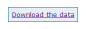
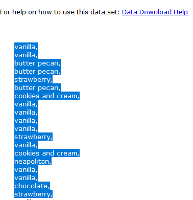

You have several options for getting raw data into R. This can occasionally be a difficult process, particularly if your data are in a non-standard format (like data from Perdisco).

### 2.1 Entering Data Manually

When provided with a small set of data, the easiest way to get it into R is to enter it manually. For example, suppose you are given the following short list of data in a homework question:

> Here is a sample of money spent on fuel per week:<br>
> $45.00 $11.00 $13.00 $14.50 $65.00 $27.50 $32.00 $8.00

To enter it into R, add a line in your homework script that looks like this:
    
```{r}
mydata <- c(45.00, 11.00, 13.00, 14.50, 65.00, 27.50, 32.00, 8.00)
```

You are creating a new *object* in R called `mydata` that contains a list of the data points. Notice that the data points are separated by commas, and are inside `c()` which is an R *function* that stands for *combine*. Put your cursor in front of `mydata` and click the "Run" button on the top right of the script pane to enter the new object into the R console. You can now view the datapoints in the "mydata" object by typing 'mydata' into the console and hitting enter:
    
```{r}
mydata
```

If you need to enter data consisting of words (also called strings, or characters), the process is similar to what you used for numeric data above. The difference is that each individual datapoint (i.e., each word) must be wrapped in quotation marks (""). For example, a dataset of fruits:

```{r}
myfruits <- c("apple","orange","pear","banana")
```

If you need to check which type of data (e.g. numeric or word/character) is contained in a dataset, use the `class()` function:

```{r}
class(mydata)
class(myfruits)
```

Note that `numeric` corresponds to data we call *quantitative* in STAT 301, and `character` corresponds to data we call *categorical* in STAT 301.

### 2.2 Read in Perdisco Homework Data

1. Start by clicking on the "Download the Data" button next to the dataset you want:
    
    
    
    This will pop open a new window containing your dataset. Take a close look at the contents and consider the answers to the following questions: 
    
    a. Is there a single column of data, or more than one column?
    b. Is there a *header* at the top of the column(s)? That is, do the column(s) have names?
    c. How are the data points separated? (For all Perdisco files you will access, the answer is probably commas)
<br><br>
2. Next, select and copy all the values in the popup (ignoring the "For help..." line at the top of the page):
    
    
<br><br>
3. Paste the values into a text editor (like Notepad on Windows, or Text Edit on a Mac).

4. Save the file in your text editor to a suitable folder (e.g., Downloads), giving it a memorable name that ends in ".txt" like "mydata.txt".

5. Set your R working directory to the location of your data file (Session > Set Working Directory > Choose Directory)

6. Use the `read.table()` *function* to read the data into R. The `read.table` function requires you to specify three *arguments* (i.e., options): the data source (the full name of the file), if the file has *headers*, and how the individual data points are separated from each other (commas). For the example above, you would add the following line to your script:
    
    ```{r, echo=FALSE, warning=FALSE,message=FALSE,error=FALSE}
    set.seed(2017)
    #Generate the sample dataset to be read in
    out = round(rnorm(100,2,1),2)
    out = cbind(out,NA)
    write.table(out,file='example.txt',sep=',',row.names=F, col.names=F)
    mydata = read.table(file = 'example.txt', header = FALSE, sep = ",")
    nl <- capture.output(file.remove('example.txt'))
    ```
    
    ```{r, eval=FALSE}
    mydata <- read.table(file = "mydata.txt", header = FALSE, sep = ",")
    ```

6. You will probably see the following warning message in the console:
    
    > Warning message: <br>
    > In scan(file = file, what = what, sep = sep, quote = quote, dec = dec,  : <br>
    > number of items read is not a multiple of the number of columns
    
    This is due to a quirk in Perdisco's text files that creates an extra column of empty values you don't want. If you see this warning, add the following      line to your script and run it after the code above to get rid of the extra column. At this point, don't worry about exactly what this code is doing.
    
    ```{r}
    mydata <- mydata[,-ncol(mydata)]
    ```
    
7. You can now look at the dataset in R by typing `mydata` into the console. If your dataset only had one column, you should get something that looks similar to the following output:
    
    ```{r}
    mydata
    ```

Note that Perdisco also provides instructions on their site for importing homework data into an Excel file. If you do this, see the information below for how to import the Excel data into R.

### 2.3 Read Excel (or CSV) Data into R

1. Open the Excel file and determine if there are column names (i.e., *headers*) present.
2. Save the Excel file in CSV (comma-separated-values) format. In Excel, click File > Save As > Save as Type: CSV (comma-delimited)(*.csv). Confirm you want to use this format. This will save a text version of the Excel table that is readable by R.
2. Tell RStudio which folder the new CSV file is located. In the top menu of RStudio, click on Session > Set Working Directory > Choose Directory, and then pick the folder that contains your CSV file.
3. Use the `read.table()` function to read in the CSV file. Similar to above, you will need to provide the file name in quotes, if the file has *headers* (`TRUE` or `FALSE`), and the way values are separated (always commas for CSV files):

    ```{r, eval=FALSE}
    mydata <- read.table(file = "YOURFILENAME.csv", header = FALSE, sep = ",")
    ```

### 2.4 Selecting Individual Columns of Data <a id="columns"></a>

Frequently, you will be working with a dataset that contains multiple columns of data. For example, the `mtcars` dataset (it's  built into R) contains several columns of information about different car models. Here are the first several rows:

```{r}
head(mtcars)
```

You may need to work with only a single data column, say the miles-per-gallon column (`mpg`). To select only this column, type the name of the dataset (`mtcars`) followed by the `$` operator, followed by the name of the column you are interested in (`mpg`):

```{r}
mtcars$mpg
```

This will print only the data in the `mpg` column to the console.
